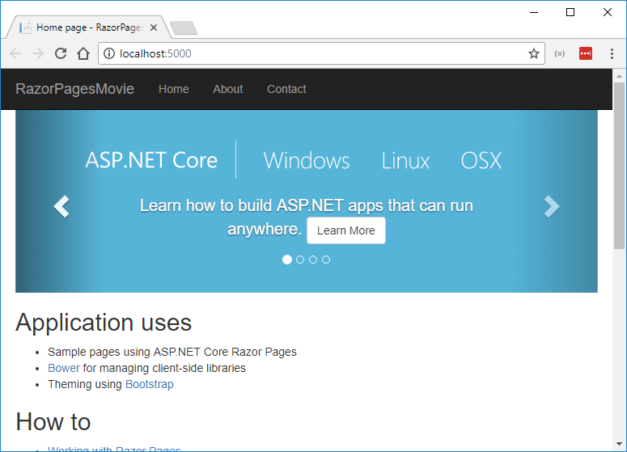

# Getting started with Razor Pages in ASP.NET Core with Visual Studio for Mac

By [Rick Anderson](https://twitter.com/RickAndMSFT)

This tutorial teaches the basics of building an ASP.NET Core Razor Pages web app. We recommend you review [Introduction to Razor Pages](xref:mvc/razor-pages/index) before starting this tutorial. Razor Pages is the recommended way to build UI for web applications in ASP.NET Core.

## Prerequisites

Install the following:

* [.NET Core 2.0.0 SDK](https://www.microsoft.com/net/core) or later
* [Visual Studio for Mac](https://www.visualstudio.com/vs/visual-studio-mac/)

## Create a Razor web app

From a terminal, run the following commands:

```console
dotnet new razor -o RazorPagesMovie
cd RazorPagesMovie
dotnet run
```

The preceding commands use the [.NET Core CLI](https://docs.microsoft.com/dotnet/core/tools/dotnet) to create and run a Razor Pages project. Open a browser to http://localhost:5000 to view the application.



[!INCLUDE[razor-pages-start](../../includes/RP/razor-pages-start.md)]

## Open the project

Press Ctrl+C to shut down the application.

From Visual Studio, select **File > Open**, and then select the *RazorPagesMovie.csproj* file.

### Launch the app

In Visual Studio, select **Run > Start Without Debugging** to launch the app. Visual Studio starts [IIS Express](https://docs.microsoft.com/iis/extensions/introduction-to-iis-express/iis-express-overview), launches a browser, and navigates to `http://localhost:5000`.

In the next tutorial, we add a model to the project.

>[!div class="step-by-step"]
[Next: Adding a model](xref:tutorials/razor-pages-mac/model)
